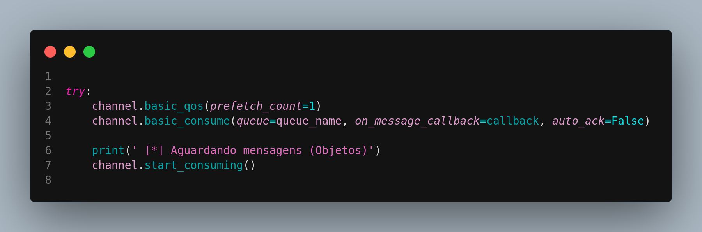

# Projeto de Análise de Imagens com Filas RabbitMQ + IA embutida

Este projeto demonstra uma arquitetura de processamento de imagens utilizando filas de mensagens RabbitMQ para desacoplar as etapas de geração e análise de imagens. O sistema é composto por três serviços principais, orquestrados com Docker Compose:

* **Gerador (`gerador`):** Responsável por selecionar aleatoriamente arquivos de imagem de duas pastas (`images/faces` e `images/objects`) e enviar o nome do arquivo como uma mensagem para o RabbitMQ, roteando-as para exchanges específicas (`face` ou `objects`).
* **Consumidor de Sentimentos (`consumer_face`):** Um consumidor do RabbitMQ que recebe mensagens roteadas para a fila de sentimentos (`fila_sentimentos`). Ele utiliza a biblioteca `deepface` para analisar as emoções faciais nas imagens recebidas.
* **Consumidor de Objetos (`consumer_objects`):** Outro consumidor do RabbitMQ que recebe mensagens roteadas para a fila de objetos (`fila_objetos`). Ele utiliza o modelo YOLOv8 para detectar objetos nas imagens recebidas.
* **RabbitMQ (`rabbitmq`):** O broker de mensagens que facilita a comunicação assíncrona entre os serviços.

## Pré-requisitos

* **Docker:** Certifique-se de ter o Docker instalado em sua máquina. Você pode encontrar as instruções de instalação para sua plataforma em [https://docs.docker.com/get-docker/](https://docs.docker.com/get-docker/).
* **Docker Compose:** O Docker Compose geralmente é instalado junto com o Docker Desktop. Se você precisa instalá-lo separadamente, siga as instruções em [https://docs.docker.com/compose/install/](https://docs.docker.com/compose/install/).
* **Imagens nas pastas `images/faces` e `images/objects`:** Crie as pastas `images/faces` e `images/objects` no mesmo diretório do arquivo `docker-compose.yaml` e adicione arquivos de imagem (JPG, PNG, etc.) relevantes para análise de rosto e detecção de objetos, respectivamente.

## 📦 Estrutura do projeto e seus Componentes

```
.
├── consumer_face/
│   ├── consumer_face.py
│   └── Dockerfile
│   └── requirements.txt
├── consumer_objects/
│   ├── consumer_objects.py
│   └── Dockerfile
│   └── requirements.txt
├── gerador/
│   ├── generator.py
│   └── Dockerfile
│   └── requirements.txt
├── images/
│   ├── faces/
│   └── objects/
└── docker-compose.yaml
```
## Como Executar o Projeto

1.  **Clone este repositório  ou crie a estrutura de arquivos conforme descrito.** Certifique-se de ter os arquivos e pastas na estrutura correta.

2.  **Navegue até o diretório raiz do projeto no seu terminal.** Este diretório deve conter o arquivo `docker-compose.yaml` e a pasta `images`.

3.  **Execute o comando para subir os containers:**

    ```bash
    docker-compose up -d --build ou docker-compose up
    ```

    A flag `-d` faz com que os containers rodem em background, e a flag `--build` garante que as imagens Docker sejam construídas (ou reconstruídas, se houver alterações) antes de iniciar os containers.

4.  **Acompanhe os logs dos serviços:**

    Para ver os logs de um serviço específico, use:

    ```bash
    docker-compose logs <nome_do_servico>
    ```

    No caso deste projeto:

    ```bash
    docker-compose logs gerador
    docker-compose logs consumidor_sentimentos
    docker-compose logs consumidor_objetos
    docker-compose logs rabbitmq
    ```

5.  **Acesse a interface de gerenciamento do RabbitMQ (opcional):**

    Se configurado corretamente (verifique a seção `ports` no `docker-compose.yaml`), você pode acessar a interface web do RabbitMQ Management Plugin através do seu navegador na porta 15672 (geralmente `http://localhost:15672`). As credenciais padrão são `guest/guest`. Nesta interface, você pode monitorar as exchanges (`mensagens`), as filas (`fila_sentimentos`, `fila_objetos`) e as mensagens.


    Na interface de gerênciamento, selecione a opção queues para visualizar as filas de imagens.

    

    Durante a configuração dos consumidores, é preciso configurar a forma de reconhecimento das mensagens. Na imagem abaixo é apresentada a configuração do reconhecimento deste projeto.

    

    Quando ``auto_ack=False``, isso significa que o consumidor precisa explicitamente enviar um acknowledgment de volta ao RabbitMQ após ter recebido e processado com sucesso uma mensagem, pois o reconhecimento automático está desabilitado.

    Se  ``auto_ack= True``, o RabbitMQ remove a mensagem da fila assim que a entrega ao consumidor, sem esperar por uma confirmação de processamento. Essa configuração é mais rápido, mas menos confiável, pois se o consumidor falhar antes de processar a mensagem, ela seria perdida.


    ### Quando ``auto_ack= True`` a fila apresentada na interface apresentará apenas a taxa de entrada de mensagens (ex: 3.0/s) e os demais valores, como ready, Unacked e Total estarão zerados, justamente porque o reconhecimento é automático e à medida que as mensagens são entregues aos consumidores, elas são removidas da fila sem a necessidade de uma resposta.
## Como Funciona

1.  O `gerador` escolhe aleatoriamente um arquivo de imagem das pastas `images/faces` ou `images/objects`.
2.  O conteúdo binário do arquivo de imagem é publicado no exchange `mensagens` do RabbitMQ.
    * Se a imagem for escolhida da pasta `faces`, a mensagem (contendo o conteúdo binário da imagem) é roteada com a routing key `face`.
    * Se a imagem for escolhida da pasta `objects`, a mensagem (contendo o conteúdo binário da imagem) é roteada com a routing key `objects`.
3.  O `consumidor_sentimentos` está vinculado à fila `fila_sentimentos` com a routing key `face` e consome as mensagens contendo o conteúdo binário da imagem. Ele salva a imagem em um arquivo local e, em seguida, utiliza a biblioteca `deepface` para analisar as emoções faciais.
4.  O `consumidor_objetos` está vinculado à fila `fila_objetos` com a routing key `objects` e consome as mensagens contendo o conteúdo binário da imagem. Ele salva a imagem em um arquivo local e, em seguida, utiliza o modelo YOLOv8 para detectar objetos.
5.  Os resultados das análises (emoções detectadas ou objetos identificados) e o caminho do arquivo salvo são impressos nos logs dos respectivos consumidores.

## Alterando as Imagens

Para adicionar, remover ou modificar as imagens nas pastas `images/faces` e `images/objects`, basta alterar os arquivos nessas pastas no seu sistema de arquivos local.

## 🔧 Tecnologias Utilizadas

    Python 3.10+

    RabbitMQ

    Pika

    DeepFace

    Ultralytics YOLOv8

    Docker + Docker Compose

## Autores

Projeto desenvolvido por Nara
